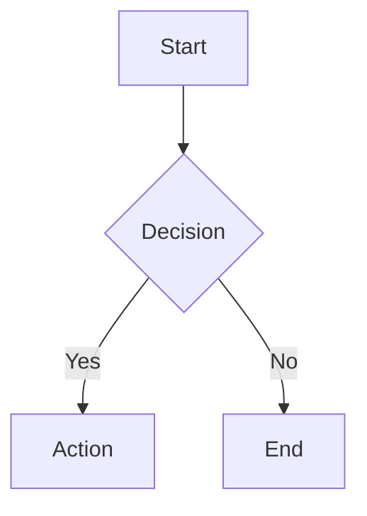

# Mermaid.js v11

Create text-based diagrams using Mermaid.js v11 declarative syntax.

## When to Use

- Visualizing architecture or data flow
- Documenting sequences and interactions
- ER diagrams for database schemas
- Gantt charts for project timelines
- State machines and workflows

## Common Diagram Types

| Type | Use Case |
|------|----------|
| `flowchart` | Process flows, decision trees |
| `sequenceDiagram` | Actor interactions, API flows |
| `classDiagram` | OOP structures, data models |
| `stateDiagram-v2` | State machines, workflows |
| `erDiagram` | Database relationships |
| `gantt` | Project timelines |
| `journey` | User experience flows |
| `architecture` | System component diagrams |

## Inline Markdown Usage

````markdown

````

## Configuration via Frontmatter

````markdown

````

## CLI Conversion

```bash
# Install
npm install -g @mermaid-js/mermaid-cli

# Convert to SVG/PNG
mmdc -i diagram.mmd -o diagram.svg
mmdc -i input.mmd -o output.png -t dark -b transparent
```

## v11 Syntax Rules

- Use `flowchart` not `graph` (deprecated)
- Use `stateDiagram-v2` not `stateDiagram`
- Node IDs: alphanumeric + hyphens only (no spaces)
- Comments: `%% comment text`
- Subgraphs: `subgraph Title\n  ...\nend`
- Arrow labels: `A -->|label| B`

## Common Pitfalls

- Special characters in node labels must be quoted: `A["label with (parens)"]`
- Long node IDs cause layout issues — keep short, use labels for display text
- Circular references in flowcharts render unpredictably — break cycles

## References

- `references/diagram-types.md` — Syntax for all 24+ types
- `references/configuration.md` — Config, theming, accessibility
- `references/cli-usage.md` — CLI commands and batch workflows
- `references/examples.md` — Practical patterns and use cases
